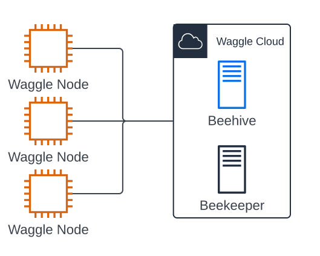
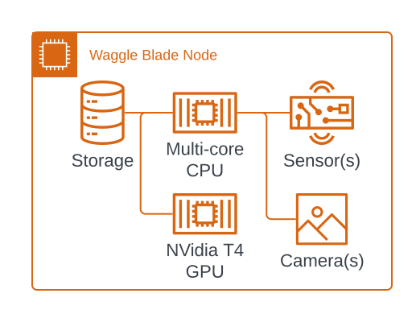
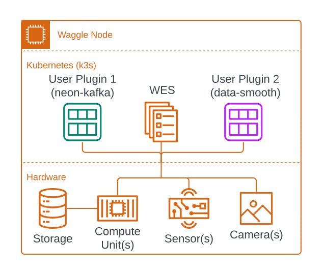

# Architecture

The Waggle cyberinfrastructure consists of coordinating hardware and software services enabling AI at the edge. Below is a quick summary of the different infrastructure pieces, starting at the highest-level and zooming into each component to understand the relationships and role each plays.

## High-Level Infrastructure



There are 2 main components of the Waggle cyberinfrastructure:
- the [Waggle Nodes](#waggle-nodes) that exist at the edge
- the Waggle Cloud that hosts services and storage systems to facilitate running [“science goals”](#science-goals) @ the edge

Every edge node maintains connections to 2 core Waggle Cloud components: 1 to a [Beehive](#beehive) and 1 to a [Beekeeper](#beekeper)

### Beekeeper

The Beekeeper is an administrative server that allows system administrators to perform actions on the nodes such as gather health metrics, and perform software updates.  All Waggle nodes "phone home" to their Beekeeper and maintain this "life-line" connection.

> Details & source code: https://github.com/waggle-sensor/beekeeper

### Beehive

The Waggle node <-> Beehive connection is the pipeline for the science. It is over this connection that instructions for the node will be sent, in addition to how data is published into the Beehive storage systems from [“science goals”](#science-goals) [plugins](#what-is-a-plugin) running on the nodes.

The overall Waggle infrastructure supports multiple Beehives, where each Waggle nodes is associated with a single Beehive. The set of nodes associated with a Beehive creates a "project" where each "project" is separate, having its own data store, web services, etc.


In the example above, there are 2 Waggle nodes associated with Beehive 1, while a single Waggle node is associated with Beehive 2.  With all Waggle nodes, in this example, being administered by a single [Beekeeper](#beekeeper).

> _Note_: the example above shows a single Beekeeper, but a second Beekeeper could have been used for administrative isolation.

> Details & source code: https://github.com/waggle-sensor/waggle-beehive-v2

## Beehive Infrastructure

Looking deeper into the Waggle Beehive infrastructure, it contains 2 main components:
- software services such as the [Edge Scheduler (ES)](#edge-scheduler-es), [Lambda Triggers (LT)](#lambda-triggers-lt), data APIs, and website hosting
- data storage systems such as the [Data Repository (DR)](#data-repository-dr) and the [Edge Code Repository (ECR)](#edge-code-repository-ecr)


The Beehive is the “command center” for interacting with the Waggle nodes at the edge. Hosting websites and interfaces allowing scientists to create [“science goals”](#science-goals) to run [plugins](#what-is-a-plugins) at the edge & browse the data produced by those [plugins](#what-is-a-plugin).


The software services and data storage systems are deployed within a [kubernetes](https://kubernetes.io/) environment to allow for easy administration and to support running in a multiple server architecture, supporting redundancy and service replication.

While the services running within Beehive are many (both graphical and [REST](https://en.wikipedia.org/wiki/Representational_state_transfer) style API interfaces), the following is an outline of the most vital.

### Data Repository (DR)

The Data Repository is the data store for housing all the edge produced [plugin](#what-is-a-plugin) data. It consists of different storage technologies (i.e. [influxdb](https://www.influxdata.com/)) and techniques to store simple textual data (i.e. key-value pairs) in addition to large blobular data (i.e. audio, images, video). The Data Repository additionally has an API interface for easy access to this data.

The data store is a time-series database of key-value pairs with each entry containing metadata about how and when the data originated @ the edge. Included in this metadata is the data collection timestamp, [plugin](#what-is-a-plugin) version used to collect the data, the [Waggle node](#waggle-nodes) the [plugin](#what-is-a-plugin) was run on, and the specific compute unit within the node that the [plugin](#what-is-a-plugin) was running on.

```json
{
    "timestamp":"2022-06-10T22:37:47.369013647Z",
    "name":"iio.in_temp_input",
    "value":25050,
    "meta":{
        "host":"0000dca632ed6d06.ws-rpi",
        "job":"sage",
        "node":"000048b02d35a97c",
        "plugin":"plugin-iio:0.6.0",
        "sensor":"bme680",
        "task":"iio-rpi",
        "vsn":"W08C"
    }
}
```

In the above example, the value of `25050` was collected @ `2022-06-10T22:37:47.369013647Z` from the `bme680` sensor on node `000048b02d35a97c` via the `plugin-iio:0.6.0` [plugin](#what-is-a-plugin).

> _Note_: see the [Access and use data](https://docs.waggle-edge.ai/docs/tutorials/accessing-data) site for more details and data access examples.

> Details & source code: https://github.com/waggle-sensor/data-repository

### Edge Scheduler (ES)

The Edge Scheduler is defined as the suite of services running in Beehive that facilitate running [plugins](#what-is-a-plugin) @ the edge. Included here are user interfaces and APIs for scientists to create and manage their [“science goals”](#science-goals). The Edge Scheduler continously analyzes node workloads against all the [“science goals”](#science-goals) to determine how the [“science goals”](#science-goals) are deployed to the Beehive nodes. When it is determined that a node's [“science goals”](#science-goals) are to be updated, the Edge Scheduler interfaces with [WES](#waggle-edge-stack-wes) running on those nodes to update the node's local copy of hte [“science goals”](#science-goals). Essentially, the Edge Scheduler is the overseer of all the Beehive's nodes, deploying [“science goals”](#science-goals) to them to meet the scientists [plugin](#what-is-a-plugin) execution objectives.

> Details & source code: https://github.com/waggle-sensor/edge-scheduler

### Edge Code Repository (ECR)

The Edge Code Repository is the "app store" that hosts all the tested and benchmarked edge [plugins](#what-is-a-plugin) that can be deployed to the nodes. This is the interface allowing users to discover existing [plugins](#what-is-a-plugin) (for potential inclusion in their [“science goals”](#science-goals)) in addition to submitting their own. At it's core, the ECR provides a verified and versioned repository of [plugin](#what-is-a-plugin) [Docker](https://www.docker.com) images that are pulled by the nodes when a [plugin](#what-is-a-plugin) is to be downloaded as run-time component of a [“science goal”](#science-goals).

> Details & source code: https://github.com/waggle-sensor/edge-code-repository

### Lambda Triggers (LT)

The Lambda Triggers service provides a framework for running reactive code within the Beehive. There are two kinds of reaction triggers considered here: From-Edge and To-Edge.

From-Edge triggers, or messages that originate from an edge node, can be used to trigger lambda functions -- for example, if high wind velocity is detected, a function could be triggered to determine how to reconfigure sensors or launch a computation or send an alert.

To-Edge triggers are messages that are to change a node's behavior. For example an HPC calculation or cloud-based data analysis could trigger an [Edge Scheduler](#edge-scheduler-es) API call to request a [“science goal”](#science-goals) to be run on a particular set of edge nodes.

> Details & source code: https://github.com/waggle-sensor/lambda-triggers

## Waggle Nodes

The Waggle nodes are the edge computing component of the cyberinfrastructure. All Waggle nodes consist of 3 items:
1. **Persisent storage** for housing downloaded [plugins](#what-is-a-plugin) and caching published data before it is transferred to the node's Beehive
2. **CPU and GPU compute modules** where [plugins](#what-is-a-plugin) are executed and perform the accelerated inferences
3. **Sensors** such as environment sensors, cameras and [LiDAR systems](https://en.wikipedia.org/wiki/Lidar)


Waggle nodes enable @ the edge fast computation, leveraging the large non-volatile storage to handle caching of high frequency data (including images, audio and video) in the event the node is "offline" from its Beehive.  Through expansion ports the nodes support the adding and removing of sensors to fully customize the node deployments for the particular deployment environment.

Overall, even though the nodes may use different CPU architectures and different sensor configurations, they all leverage the same [Waggle Edge Stack (WES)](#waggle-edge-stack-wes) to run [plugins](#what-is-a-plugin).

> Details & source code: https://github.com/waggle-sensor/wild-waggle-node

### Wild Waggle Node

The Wild Waggle Node is a custom built weather-proof enclosure intended for remote outdoor installation. The node features software and hardware resilience via the [custom Waggle operating system](https://github.com/waggle-sensor/wildnode-image) and [custom Wagman circuit board](https://github.com/waggle-sensor/wagman). Internal to the node is a power supply and PoE network switch supporting the addition of sensors through standard Ethernet (PoE), USB and other embedded protocols via the node expansion ports.


The technical capabilities of the Wild Waggle Node consists of:
- NVidia Xavier NX ARM64 [Node Controller](https://github.com/waggle-sensor/nodecontroller-arm64) w/ 8GB of shared CPU/GPU RAM
- 1 TB of NVMe storage
- 4x PoE expansion ports
- 1x USB2 expansion port
- optional [Stevenson Shield](https://en.wikipedia.org/wiki/Stevenson_screen) housing a RPi 4 w/ environmental sensors & microphone
- optional 2nd NVidia Xavier NX ARM64 Edge Processor

> Manual: https://docs.waggle-edge.ai/docs/about/resources/wsn-manual

> Details & source code: https://github.com/waggle-sensor/wild-waggle-node

### Waggle Blade Node

The Waggle Blade Node is a standard commercially available server intended for us in a climate controlled machine room, or extended temperature range telecom-grade blades for harsher environments. The [AMD64 based Waggle operating system](https://github.com/waggle-sensor/blade-image) supports these types of nodes, enabling the services needed to support [WES](#waggle-edge-stack-wes).



The above diagram shows the basic technical configuration of a Waggle Blade Node:
- Multi-core ARM64 Node Controller
- 32GB of RAM
- Dedicated NVida T4 GPU
- 1 TB of SSD storage

> _Note_: it is possible to add the same optional [Stevenson Shield](https://en.wikipedia.org/wiki/Stevenson_screen) housing that is available to the [Wild Waggle Nodes](#wild-waggle-node)

> Details & source code: https://github.com/waggle-sensor/waggle-blade

## Running Applications @ the Edge

Included in the Waggle operating systems are the core components necessary to enable running [plugins](#what-is-a-plugin) @ the edge.  At the heart of this is [k3s](https://k3s.io/), which creates a protected & isolated run-time environment. This environment combined with the tools and services provided by [WES](#waggle-edge-stack-wes) enable [plugin](#what-is-a-plugin) access to the node's CPU, GPU, sensors and cameras.

### Waggle Edge Stack (WES)

The Waggle Edge Stack is the set of core services running within the [Waggle node's](#waggle-nodes) [k3s](https://k3s.io/) run-time environment that supports all the features that [plugins](#what-is-a-plugin) need to run on the Waggle nodes. The WES services coordinate with the core [Beehive](#beehive) services to download & run scheduled [plugins](#what-is-a-plugin) (including load balancing) and facilitate uploading [plugin](#what-is-a-plugin) published data to the Beehive [data repository](#data-repository-dr). Through abstraction technologies and WES provided tools, [plugins](#what-is-a-plugin) have access to sensor and camera data.



The above diagram demonstrates 2 [plugins](#what-is-a-plugin) running on a Waggle node.  Plugin 1 ("neon-kafka") is an example [plugin](#what-is-a-plugin) that is running alongside Plugin 2 ("data-smooth"). In this example, "neon-kafka" (via the WES tools) is reading metrics from the node's sensors and then publishing that data within the WES run-time environment (internal to the node). 
At the same time, the "data-smooth" [plugin](#what-is-a-plugin) is subscribing to this data stream, performing some sort of inference and then publishing the inference results (via WES tools) to Beehive.

> _Note_: see [Developing new edge applications](https://docs.waggle-edge.ai/docs/tutorials/compute-at-edge#developing-new-edge-applications) for a guide on how to create a Waggle [plugin](#what-is-a-plugin).

> Details & source code: https://github.com/waggle-sensor/waggle-edge-stack

### What is a plugin

Plugins are the user developed module that the Waggle cyberinfrastructure is designed around. At it's simplest definition a "plugin" is code that runs @ the edge to perform some task. That task may be simply collecting sample camera images or a complex inference combining sensor data and results published from other plugins. A plugin's code will interface with the edge node's sensor(s) and then publish resulting data via the tools provided by [WES](#waggle-edge-stack-wes). All developed plugins are hosted by the Beehive [Edge Code Repository](#edge-code-repository-ecr).

> See [how to create plugins](https://docs.waggle-edge.ai/docs/tutorials/compute-at-edge) for details.

### Science Goals

A "science goal" is a rule-set for how and when [plugins](#what-is-a-plugin) are run on edge nodes. These "science goals" are created by scientist to accomplish a science objective through the execution of [plugins](#what-is-a-plugin) in a specific manner. Goals are created, in a human language, and managed within the Beehive [Edge Scheduler](#edge-scheduler-es). It is then the cyberinfrastucture responsibility to deploy the "science goals" to the edge nodes and execute the goal's [plugins](#what-is-a-plugins).

> See [how to schedule a plugin for deployment](https://docs.waggle-edge.ai/docs/tutorials/compute-at-edge#schedule-plugin-for-deployment) for details.
