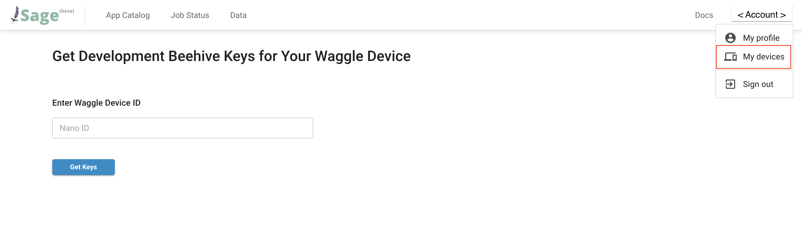

# Building your own Waggle Device

<!-- Talk about why someone woudl wnat to make their own waggle device
- Why someone would want to create their own waggle device ?  (for local development, classroom, etc.) -->

Do you ever look into the sky and wonder how will the cloud move over time? Do you ever want to know if a wildfire is possibly to start in a forest? If you would like to build, design and deploy a software that could answer your questions above, then Waggle is the right choice for you. Waggle is an edge computing wireless sensor device, say, you can define what the device will be detecting by building a software on it.

If you would like to gain more understandings and share your own observation, this tutorial will give you a guide of how to register your Waggle device to the Sage network. After registering, you can publish your observation and see others data on [Sage Portal](https://portal.sagecontinuum.org/apps/explore).

## Potential Use Cases

You might be ...
- a professor that wants to introduce Waggle device to your students and plans to instruct students to make 20+ waggle devices
- someone interested in Waggle and making an app but doesnt have access to production nodes
- a new user of waggle network that wants to use a new sensor (i.e. a new camera, a new bat singal detector, a new custom sensor they built)
  <!-- - link this "Bring your own sensor to Waggle" (./access-waggle-sensor.md) -->

If you have your device ready, you could follow the instructions in [Access Waggle sensors](./access-waggle-sensors.md) to

<!-- reference minji's concept paragraph (https://docs.google.com/document/d/1KrCU5IS5vUCSB6lj7th1JgUz4y7lYBclk5NJP_5Ijoc/edit#) -->

An inexpensive Sage Edge Computing kit that can enable students to run existing AI@Edge computations with cameras and microphones, and then develop their own codes. The Sage Beehive will host the data and make it available to cloud-based analysis tools and workflow frameworks. This document describes the overall concept, some initial goals, and workflow.

## Support Platforms

Talk about the currently only supported platform (nano) and Links to the node-platforms repo for the Nvidia Nano
The only supported platform now is Nvidia Nano, please refer to the [link] (https://github.com/waggle-sensor/node-platforms/tree/main/nvidia-nano) to see the guide of setting up Nvidia Nano.

(put a note about future supported platforms: https://github.com/waggle-sensor/node-platforms)
In the future, we will support more [platforms](https://github.com/waggle-sensor/node-platforms) such as Raspberry Pi 4, Wild Waggle Node, etc. You can also design your own device and follow the steps below to register to the platform.

## Register Your Own Device

In order to register your waggle device, you will need keys to authenticate your device with beehive when setting up your nano device. To get registration keys, please log in to [Sage Portal](https://portal.sagecontinuum.org/apps/explore) with your Globus credentials, after logging in, visit [My devices](https://portal.sagecontinuum.org/my-devices) page under your user account. Enter your device ID on "My Waggle Devices" page then click "Get Keys" button. It will generate a zip file for you. Check your downloads folder for the zip file, then move it to the same folder with the ansible script to proceed the execution.

